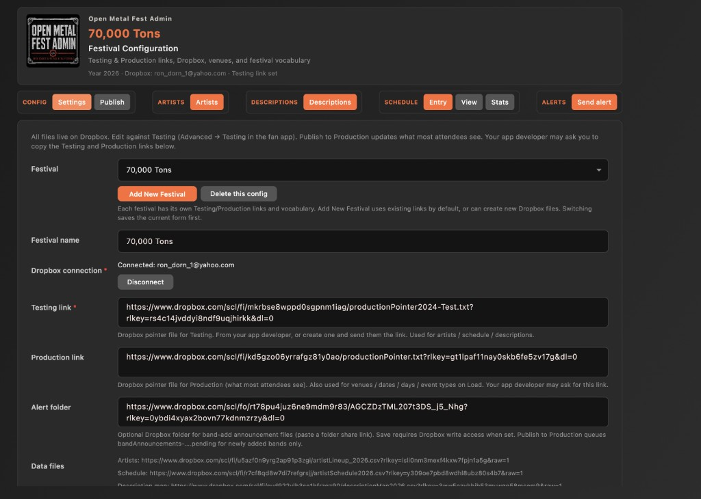
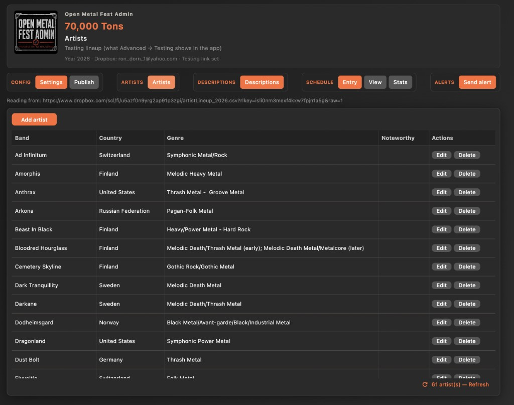
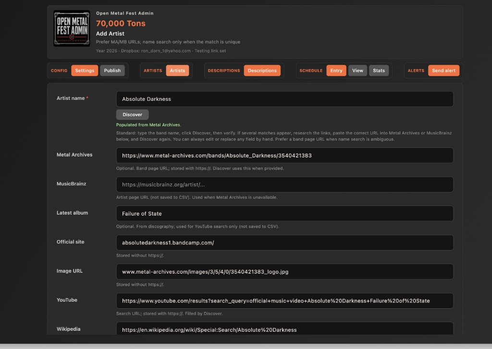
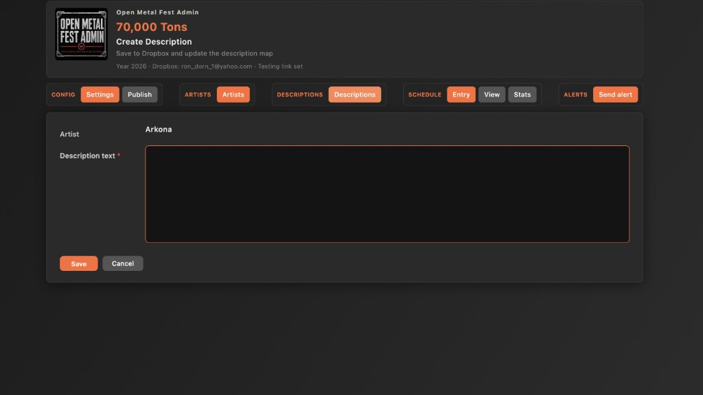
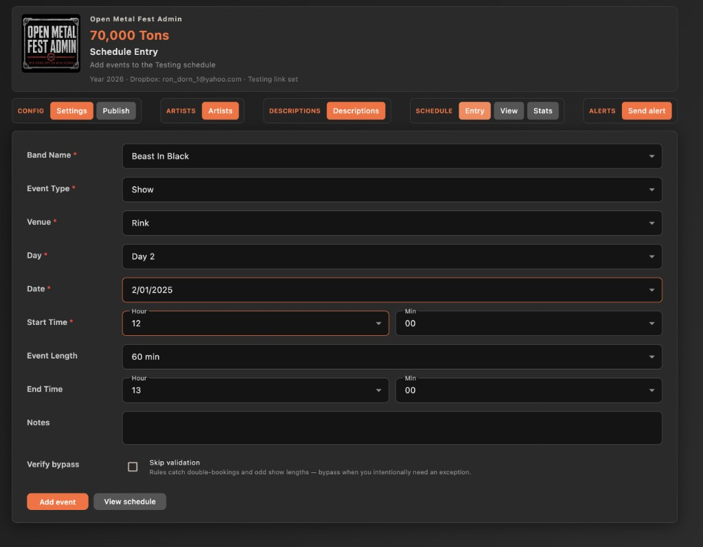
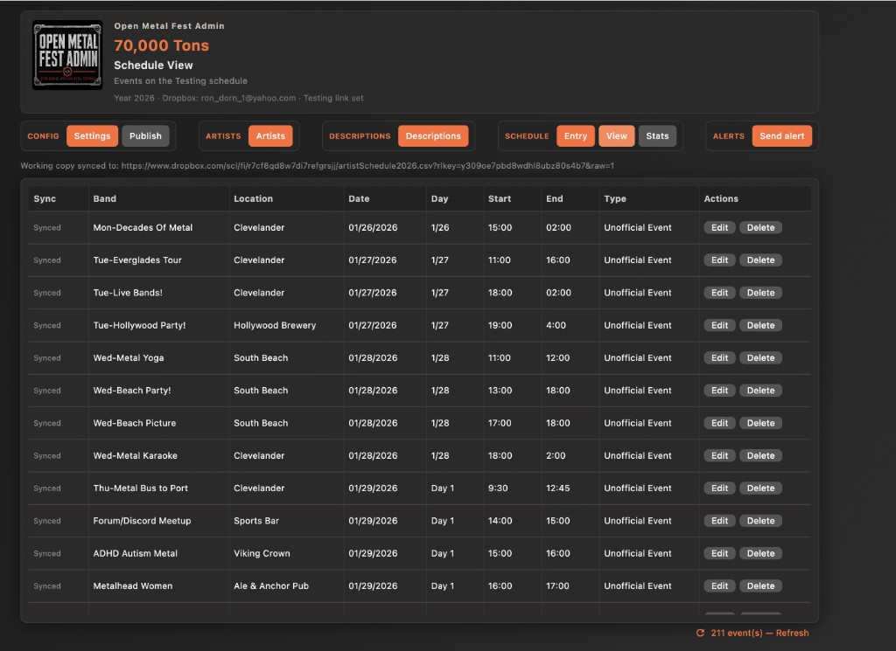
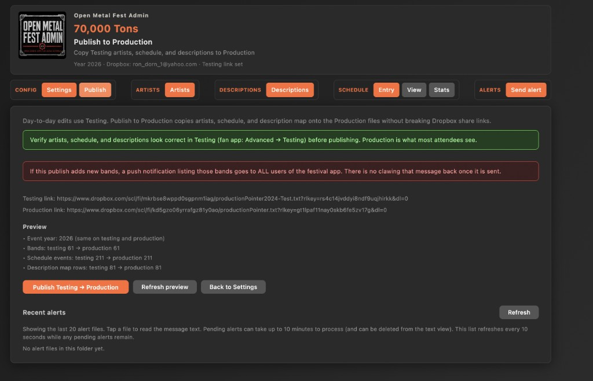
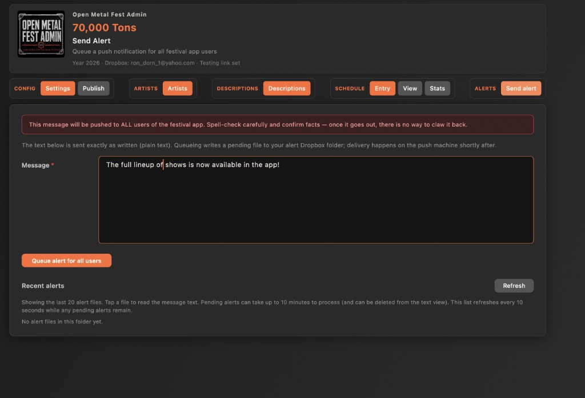

# Open Metal Fest Admin — User Guide

For official festival staff **and unofficial volunteers**.

You use **your own Dropbox account**. Either you already own the festival’s Dropbox files, or — more often — someone shares **edit access** to the files you need with your Dropbox email. There is no shared festival password.

Someone who releases or maintains the festival apps will give you the **Testing** and **Production** links for first-time setup. After that, settings rarely change. Most people spend their time on artists, descriptions, schedule, and — if authorized — publishing and notifications.

---

## What this app is for

| Area             | In plain terms                                                                                                              |
| ---------------- | --------------------------------------------------------------------------------------------------------------------------- |
| **Settings**     | One-time (or rare) festival setup: Dropbox login, Testing/Production links, optional announcement folder.                   |
| **Artists**      | Build and edit the Testing lineup: add, change, or remove bands.                                                            |
| **Descriptions** | Write or update the text fans read about a band (usually done when you add the band; you can also fix or add them later).   |
| **Schedule**     | Enter shows and other events; browse the event list; see simple stats; export a PDF/HTML running order (official admins). |
| **Publish**      | When Testing looks right, push your changes so most fans see them in Production. New bands can trigger a push notification. |
| **Send alert**   | Optional: type a message and send it to **everyone** who uses that festival’s app.                                          |

---

## Testing vs Production (the one idea to learn)

**Testing** is a safe place to make and verify changes before attendees see them. You edit Testing in this admin app every day; mistakes stay off the public festival experience until you (or someone authorized) choose to Publish.

**Production** is what most fans see by default when they open the festival app.

| | Testing | Production |
|---|---------|------------|
| **Who sees it** | People with access to Testing (often via Advanced → Testing; can be locked down) | Most attendees |
| **What you do here** | Add/edit artists, descriptions, schedule | Live lineup and schedule after Publish |
| **Risk** | Low — experiment and fix freely | Higher — fans see it; hard to undo quickly |

Before anyone Publishes, open the **festival (fan) app**, turn on **Advanced → Testing**, and confirm the lineup, descriptions, and schedule look right. That preview is how you use Testing as a safety net.

**Who can see Testing in the fan app?** By default, Advanced → Testing can expose Testing data to anyone who finds that switch. For a volunteer-run festival that only works from **already public** info, that is usually fine. If a promoter wants to enter data **before** bands are announced and is concerned that Advanced could be a back door into unannounced lineup info, that can be locked down easily: set access rights so the fan app **cannot see Testing data at all**. Ask your festival contact / app maintainer if you need that tightened.

If a button is missing or grayed out (for example you can view Artists but not Add), your Dropbox account doesn’t have edit rights on that part — ask the person who shared the festival Dropbox with you.

---

## Getting started

1. Get the festival **name**, **Testing link**, and usually **Production link** from your festival contact.
2. Ask them to share **edit** access (on Dropbox) to the files you’re supposed to work on — using **your Dropbox email**.
3. In the admin app: enter the festival, paste the links, **Connect Dropbox** with your personal account, then **Load festival data**.
4. You’re in. Work under **Artists**, **Descriptions**, and **Schedule** as needed.

Creating a brand-new festival from scratch (new empty Dropbox files) is for festival owners / developers, not a typical volunteer first step.

You can keep several festivals in the app (for example 70K and MDF) and switch them under Settings → **Festival**.

---

## Settings (leave alone most of the time)

**Nav:** CONFIG → **Settings**

You’ll mainly use Settings once:

- **Festival** — which festival you’re working on; add or delete a saved festival config.  
- **Festival name** — label in the header.  
- **Dropbox** — Connect / Disconnect with your personal account.  
- **Testing link** / **Production link** — the URLs you were given.  
- **Alert folder** — only if your festival uses push announcements (optional).  
- **Load festival data** — pull Testing/Production file URLs and fill empty Venues / Days / Dates / Event types from Production. Existing lists are kept (not overwritten).  
- **Save configuration** — keep your local settings. Changing Venues / Days / Dates / Event types refreshes Schedule Entry menus.  
- **Festival logo** — optional image URL (Dropbox share link works) used only when exporting a running order; see [Export a running order](#export-a-running-order).  
 - **Use city/state fields** — turn on if this festival tracks city/state for artists.  
- **Venues / Dates / Days / Event types** — lists used when entering schedule items (filled once by Load when empty; you edit afterward).  
- **Days / Dates alignment** — Days and Dates are ordered lists: Day line 1 pairs with Date line 1, and so on. Dates must be consecutive `M/D/YYYY` values (no leading zeros) with **one more date than days** (the last date covers overnight on the final day). **Date rollover** (default `8:00`) decides when a start time uses the next calendar date while keeping the same Day. Schedule Entry fills Date from Day + start time; you can still change Date by hand.  
- **Add new year…** — only for people who manage year transitions (starts a new Testing year; Production updates when someone Publishes).

**File access** shows whether you can edit Artists, Schedule, and Descriptions. Use **Refresh file access** if rights were just shared to you and the app still looks locked.

---

## Artists

**Nav:** ARTISTS → **Artists**

### Browse

See the Testing lineup (band, country, genre, noteworthy). Use **Refresh** if someone else changed Dropbox data.

### Add a band

**Standard workflow** (uses **Discover**, the button under **Artist name**)

1. **Add artist**.
2. Type the **band name** and click **Discover**.
3. If fields fill in automatically, **check that it’s the right band**.
4. If the app shows Metal Archives or MusicBrainz **links** (several possible matches), **open those links**, research which act is correct, paste the correct page URL into the **Metal Archives** or **MusicBrainz** field, then click **Discover** again.
5. If you get **no usable results**, ask the band for details or do public research and fill the form yourself.
6. Review every field. You may **edit, replace, clear, or add** any detail whenever you think it needs fixing (name, links, country, genre, noteworthy, and so on). Discover is a starting point, not the final word.
7. Optional: check **Add description** and write the band blurb.
8. **Save to Testing**.

Discover will not guess when several bands share a name — that’s why step 4 uses a page URL.

### Edit or remove a band

- **Edit** — change details → **Save changes**. (To change the long description text later, use the **Descriptions** section.)  
- **Delete** — remove the band from the Testing lineup (confirm first). That does not by itself send a “removed” notification to fans.

---

## Descriptions

**Nav:** DESCRIPTIONS → **Descriptions**

Use this when you need to:

- Add a description for a band that already exists without one  
- Fix or rewrite description text  
- Connect an **existing** description link (instead of writing new text)  
- Clean up bands that have a description but are no longer on the lineup  

Most of the time, adding the description **while adding the band** is simpler — this screen is the follow-up tool.

You’ll see who has a description and who doesn’t. Typical actions:

- **Create Description** — write new text for an artist  
- **Attach Link** — connect a **band** to a description that **already exists** as a Dropbox link. Use this when:  
  - the write-up is already online and you don’t need to rewrite it, or  
  - someone else wrote the description (or saved a file) but couldn’t finish connecting it for fans, and they’ve given you a valid link  
- **Edit** — change the wording (or, if offered, where the text lives)  
- **Delete** — remove that description  

If Edit / Delete / Attach Link aren’t available, you can still create description text for someone else to finish connecting — ask your festival contact (they’ll often use **Attach Link** with the URL you send them).

---

## Schedule

**Nav:** SCHEDULE → **Entry** (if you can edit) · **View** · **Stats**

Common event types: **Show**, **Clinic**, **Meet and Greet**, **Special Event**, **Unofficial Event** (festivals can add more).

Saves upload to Testing in the background. On **View**, look for **Pending** / **Synced**; use **Sync now** or **Retry sync** if something stuck.

### Shows and band events

Pick a **Band Name** from the Testing lineup, then venue, **Day**, start/end (or length), and optional **Notes**. **Date** fills from the Settings Days/Dates order and Date rollover when you pick Day or change start time — change it by hand if needed. The form remembers your last choices so you can enter several sets in a row. **Edit last entry** if you need a quick correction.

If validation complains but you’re sure the times are right, you can skip the check when that option is shown.

### Special Events and Unofficial Events

These are **not** tied to a lineup band:

- Enter an **Event title** instead of a band name  
- Optional short **Description** and optional **Image** (Dropbox image link)  
- **Special Event** = official non-band programming  
- **Unofficial Event** = fan meetups and similar

### View and Stats

- **View** — full list; edit or delete if you have schedule rights  
- **Stats** — how many of each event type each artist has

### Export a running order

On **Schedule → View**, select **Export…**. On macOS you can also use **File → Save Schedule as PDF…** or **Save Schedule as HTML…**.

#### Who this is for (important)

Exports are for **official festival admins / event promoters**. The promoter may use a PDF or HTML export as the **official** running order.

**Do not** use an export to **compete with** an official running-order PDF or official web schedule that already exists for the festival. Unofficial volunteers should not circulate an export as a public substitute for the promoter’s materials.

The export dialog also reminds you of this.

#### How to export

1. Choose **PDF** or **HTML**.
2. Choose **Color** or **Black & white**. PDF defaults to black-and-white; HTML defaults to color.
3. Check the **event types** to include. **Show** starts selected. Changing the checkboxes only affects this export — not the schedule data or the View list.
4. Save the file.

#### PDF vs HTML

| | **PDF** | **HTML** |
| --- | --- | --- |
| Layout | Letter **portrait**, printer-style (white page, outlined event boxes, hour + half-hour lines) | **Landscape** dark schedule (colorful venue blocks by default) |
| Typical use | Can be used as the **official** running order by the event promoter. Do **not** use it to compete with an official version. | Can be used as the **official** running order by the event promoter. Do **not** use it to compete with an official version. |
| Color mode | Same structure; color only tints venue headers and borders | Full color theme vs black-and-white theme |
| Crowding | Fixed printable page — fonts/boxes adjust within the page | Timeline **grows taller** when a day is long or dense so names stay readable; uncrowded days keep the same compact height |

Each festival **day** becomes one page, with venue columns and a vertical time axis. Overnight times follow the festival’s **Date rollover** setting (same rules as Schedule Entry).

#### Event-type labels

Only these types can show a type label: **Clinic**, **Meet and Greet**, and **Unofficial Event**.

- **Show** and **Special Event** are **never** labeled (on the page header or on individual events).
- **Only one** of Clinic / Meet and Greet / Unofficial Event selected → that type appears in the **page header** in plural (for example `CLINICS` or `MEET & GREETS`). Events themselves are not labeled.
- **Mixed types** selected (for example Shows + Clinics) → eligible events get a **per-event** label; Shows and Special Events stay unlabeled.
- Other custom festival types are not labeled.

Suggested save names include the event type when you export a **single** type (for example `…-shows-running-order.pdf` or `…-meet-and-greets-running-order.html`). Mixed-type exports keep a plain `…-running-order` name.

Deck / location subtitles under venue names are not exported yet (there is no separate deck field in the data).

When several bands share the **same venue and time slot** (common for Meet and Greets), they are shown together in one block (names listed with `/`). If times only partially overlap at the same venue, blocks sit side by side. Event boxes grow and fonts shrink as needed so **band names and notes are never clipped or omitted**.

#### Festival logo

Optional. In **Settings**, paste a **Festival logo** image link (a Dropbox share link works; `dl=0` is normalized to `raw=1` on save). When set, the logo appears to the **left** of the day header on each PDF page (HTML already places it in the left brand column). Keeping it beside the day title preserves vertical space for the schedule grid. If the image cannot be downloaded at export time, the export still succeeds without the logo.

---

## Publish (Testing → what fans see)

**Nav:** CONFIG → **Publish**

Publish copies your reviewed **Testing** work into **Production** so most attendees see it. Until you Publish, fans keep seeing the previous Production version — Testing stays your safe staging ground (see [Testing vs Production](#testing-vs-production-the-one-idea-to-learn)).

Only people with edit rights on Artists, Schedule, and/or Descriptions can publish — and only those parts they’re allowed to change will update.

You don’t need to wait until everything is finished before publishing. Festivals often publish in **stages**. For example, new bands may go live through the year as they are announced, descriptions can be published when they’re ready, and the schedule is often published once it’s finalized. Publish whenever a meaningful set of changes has been checked in Testing.

Before you publish:

1. Check Testing in the **fan app** (Advanced → Testing).
2. Open **Publish** and read the **preview**.
3. Note any **bands that will be announced** (new bands vs what’s already live).
4. Confirm only when you’re sure — this can’t be easily undone for fans.

### When new bands notify fans

If your festival uses announcements and you can edit artists, publishing **new** bands can automatically queue a push like “these bands were just added.” Removals are **not** auto-announced. Everyone with the festival app can get that push — spell-check names and preview the list.

Pushes often go out within about **10 minutes** after Publish (depends on the festival’s backend Mac/monitor). **Recent alerts** on the Publish screen shows pending vs sent.

---

## Send alert (broadcast message)

**Nav:** ALERTS → **Send alert** (only if your festival turned this on for you)

Type a plain message, confirm that it goes to **all** app users, and queue it. There is no “take it back” in the app after you confirm.

Use this only when you’ve been asked to, and only for messages that are **directly about the festival** and useful to attendees **right away** (lineup, schedule, venue, timing, and similar). Fans installed the app for the festival — unrelated or promotional noise is the fastest way to get them to turn off notifications or delete the app.

---

## Suggested day-to-day flow

**Most editors**

1. Connect Dropbox once; Load if links change.
2. Add or edit **Artists** (and descriptions while adding when you can).
3. Fix leftovers under **Descriptions** if needed.
4. Enter **Schedule**.
5. Preview in the fan app under Testing.
6. Don’t touch Settings unless asked.

**People who Publish / send alerts**

1. Publish when Testing is approved.
2. Send a custom alert only when intentionally messaging all users.

Volunteers who can’t Publish still improve Testing for whoever does.

---

## Quick help: “Why can’t I …?”

| Symptom                            | Likely fix                                                                                                             |
| ---------------------------------- | ---------------------------------------------------------------------------------------------------------------------- |
| No Add / Edit / Delete             | Ask for **edit** share on those Dropbox files to your personal account, then **Refresh file access**.                  |
| No Schedule **Entry**              | You can view only — need schedule edit rights.                                                                         |
| No **Publish**                     | Need edit rights on at least Artists, Schedule, or Descriptions.                                                       |
| Export vs official schedule        | Promoters may use exports as the official running order. Do **not** use them to compete with an existing official PDF or web schedule. |
| No **Send alert**                  | Festival hasn’t enabled alerts for you, or alert folder isn’t set / shared for write.                                  |
| Description won’t “stick” for fans | Usually fixed by adding it while creating the band, or asking someone with fuller rights to finish under Descriptions. |

---

## For the person who sets festivals up

Coordinate once with whoever ships the apps:

- [ ] Correct Testing and Production links  
- [ ] Each editor’s **personal Dropbox** has ownership or **shared write** on the pieces they edit  
- [ ] Fan apps point at the same Production data  
- [ ] If using pushes: shared alert folder, kept available offline on the machine that sends notifications  
- [ ] If volunteers should send freeform alerts: turn that on with the app maintainer  

After that, most people only need Artists, Descriptions, Schedule, and (when authorized) Publish.
