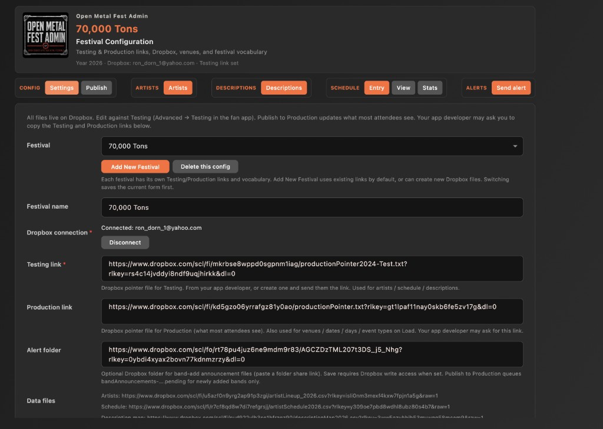
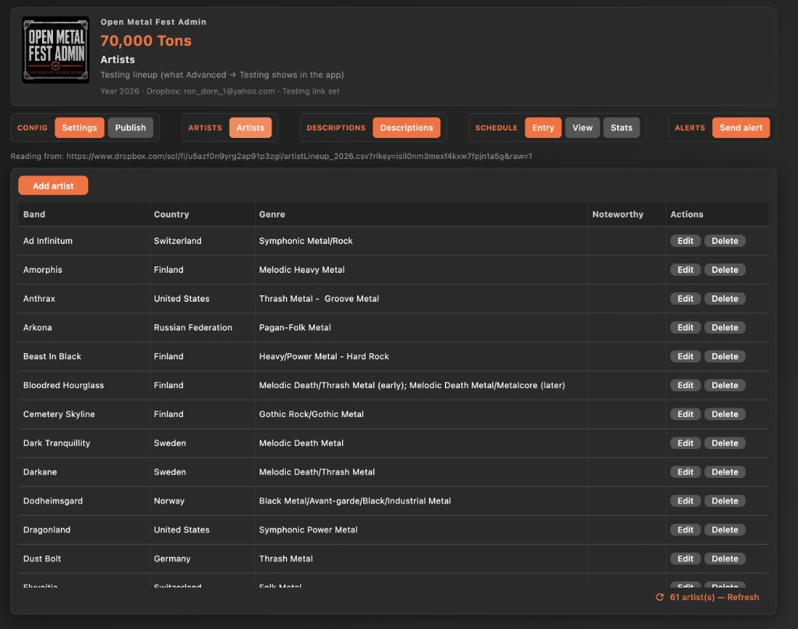
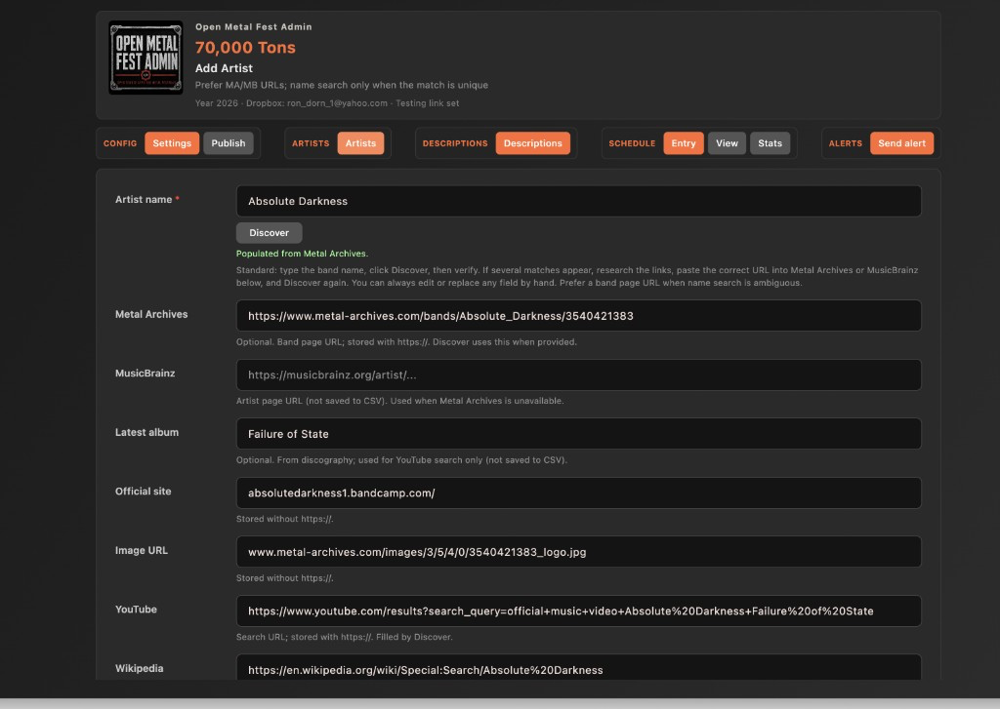
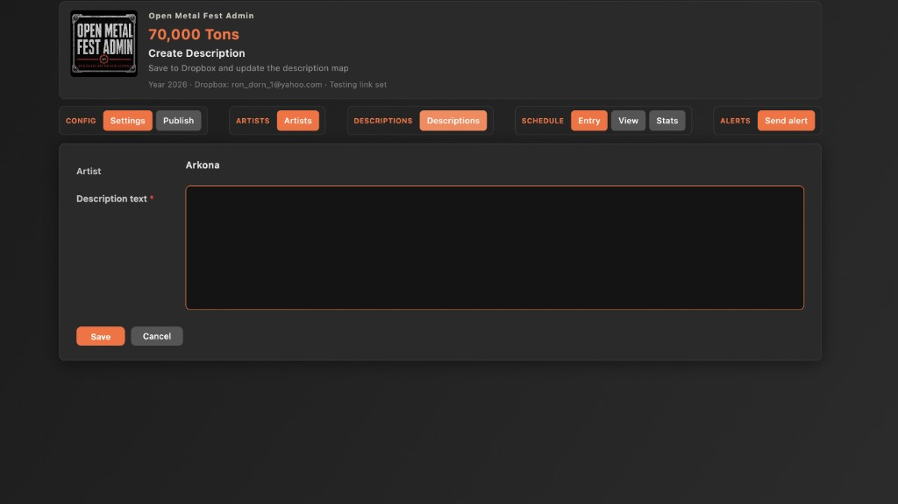
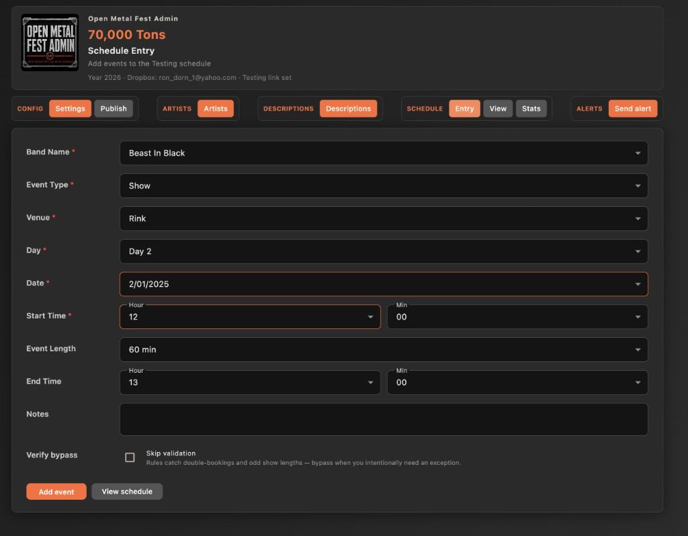
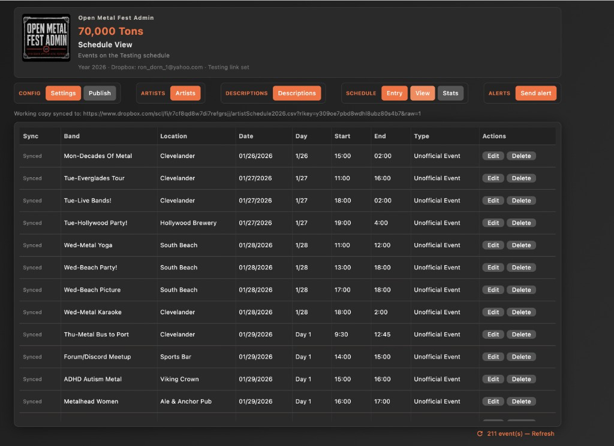
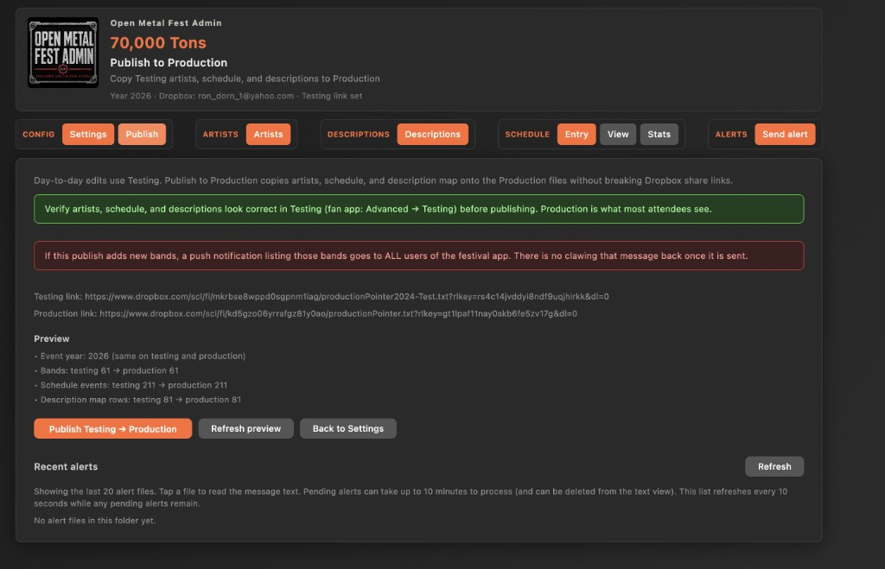
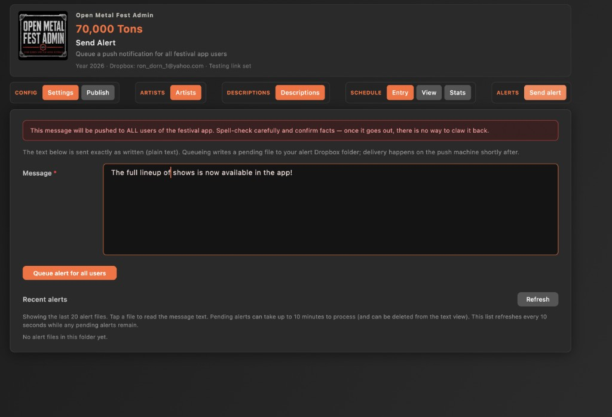

# Open Metal Fest Admin — User Guide

For official festival staff **and unofficial volunteers**.

You use **your own Dropbox account**. Either you already own the festival’s Dropbox files, or — more often — someone shares **edit access** to the files you need with your Dropbox email. There is no shared festival password.

Someone who releases or maintains the festival apps will give you the **Testing** and **Production** links for first-time setup. After that, settings rarely change. Most people spend their time on artists, descriptions, schedule, and — if authorized — publishing and notifications.

---

## Install (download the app)

| Platform    | Where to get it                                                                                                                    |
| ----------- | ---------------------------------------------------------------------------------------------------------------------------------- |
| **Mac**     | [GitHub Releases](https://github.com/rondorn/70K-Bands/releases) → **omf-admin-macos** release → download the zip under **Assets** |
| **Windows** | Same [Releases](https://github.com/rondorn/70K-Bands/releases) page → **omf-admin-windows** release → download the zip             |
| **iPad**    | **App Store** — search for **Open Metal Fest Admin**                                                                               |

**Mac:** Unzip, drag **Open Metal Fest Admin** into **Applications**, then open it. The first time, macOS may ask to confirm a download from the internet — choose **Open**.

**Windows:** Unzip and run the main `.exe` **from inside that folder** (keep the other files next to it). If SmartScreen warns you, choose **More info** → **Run anyway** when you trust the download.

**iPad:** Install from the App Store like any other app.

You do **not** need to install anything else. After the app opens, continue with [Getting started](#getting-started) (festival name, Testing/Production links, Dropbox).

When a newer version is available, update the same way you installed (Releases zip for Mac/Windows, App Store for iPad). Festival settings and your Dropbox sign-in are stored separately — updating the app does **not** wipe them. You do not need to re-enter Testing/Production links or sign in to Dropbox again after a normal update.

**Mac and iPad together:** If both devices use the same Apple ID with iCloud, festival settings and your Dropbox connection can sync between them automatically.

---

## What this app is for

| Area             | In plain terms                                                                                                                                                           |
| ---------------- | ------------------------------------------------------------------------------------------------------------------------------------------------------------------------ |
| **Settings**     | One-time (or rare) festival setup: Dropbox login, Testing/Production links, optional announcement folder.                                                                |
| **Artists**      | Build and edit the Testing lineup: add, change, or remove bands; add or edit band descriptions; export an HTML logo lineup.                                              |
| **Descriptions** | Write or update the text fans read about a band (usually done when you add the band; you can also fix or add them later).                                                |
| **Schedule**     | Enter shows and other events; browse the event list; preview the running-order layout; see simple stats; export PDF/HTML running order or a QR poster (official admins). |
| **Reports**      | View festival app usage stats (band rankings, countries, platforms, and more) when your festival sets up a reports folder.                                               |
| **Publish**      | When Testing looks right, push your changes so most fans see them in Production. New bands can trigger a push notification.                                              |
| **Send alert**   | Optional: type a message and send it to **everyone** who uses that festival’s app.                                                                                       |

---

## Testing vs Production (the one idea to learn)

**Testing** is a safe place to make and verify changes before attendees see them. You edit Testing in this admin app every day; mistakes stay off the public festival experience until you (or someone authorized) choose to Publish.

**Production** is what most fans see by default when they open the festival app.

|                      | Testing                                                                          | Production                                 |
| -------------------- | -------------------------------------------------------------------------------- | ------------------------------------------ |
| **Who sees it**      | People with access to Testing (often via Advanced → Testing; can be locked down) | Most attendees                             |
| **What you do here** | Add/edit artists, descriptions, schedule                                         | Live lineup and schedule after Publish     |
| **Risk**             | Low — experiment and fix freely                                                  | Higher — fans see it; hard to undo quickly |

**Shared files (intentional):** Some festivals (for example when an automated feed writes the lineup) point Testing **artists** at the same Dropbox file as Production. That is allowed: edits are live, and Publish skips copying artists. **Description map** may be shared or separate. **Schedule** is usually a separate Testing file that you copy on Publish (see [Publish](#publish-testing--what-fans-see)). Shared schedule feeds may be supported later; **for now** the app still requires separate Testing and Production schedule files. Festival owners can switch share/separate for artists and description map under Settings → **Data files** → **Testing vs Production files**.

Before anyone Publishes, open the **festival (fan) app**, turn on **Advanced → Testing**, and confirm the lineup, descriptions, and schedule look right. That preview is how you use Testing as a safety net.

**Who can see Testing in the fan app?** By default, Advanced → Testing can expose Testing data to anyone who finds that switch. For a volunteer-run festival that only works from **already public** info, that is usually fine. If a promoter wants to enter data **before** bands are announced and is concerned that Advanced could be a back door into unannounced lineup info, that can be locked down easily: set access rights so the fan app **cannot see Testing data at all**. Ask your festival contact / app maintainer if you need that tightened.

If a button is missing or grayed out (for example you can view Artists but not Add), your Dropbox account doesn’t have edit rights on that part — ask the person who shared the festival Dropbox with you.

---

## Getting started

1. [Install the app](#install-download-the-app) if you don’t have it yet.
2. Get the festival **name**, **Testing link**, and usually **Production link** from your festival contact.
3. Ask them to share **edit** access (on Dropbox) to the files you’re supposed to work on — using **your Dropbox email**.
4. In the admin app: enter the festival, paste the links, **[Connect Dropbox](#connecting-dropbox)** with your personal account, then **Load festival data**.
5. You’re in. Work under **Artists**, **Descriptions**, and **Schedule** as needed.

Creating a brand-new festival from scratch (new empty Dropbox files) is for festival owners / the person who maintains the apps — not a typical volunteer first step.

You can keep several festivals in the app (for example 70K and MDF) and switch them under Settings → **Festival**.

---

## Settings (leave alone most of the time)

**Nav:** CONFIG → **Settings**

You’ll mainly use Settings once:

- **Festival** — which festival you’re working on; add or delete a saved festival config.  
- **Festival name** — label in the header.  
- **Dropbox connection** — sign in with your personal account (see [Connecting Dropbox](#connecting-dropbox)).  
- **Testing link** / **Production link** — the URLs you were given.  
- **Reports folder** — optional Dropbox folder where HTML stats reports are stored (see [Stats reports](#stats-reports)). Only people with access to this folder see **Reports** in the sidebar.  
- **Alert folder** — only if your festival uses push announcements (optional). **Create alert folder on Dropbox** appears when you’re connected and the field is empty.  
- **Festival logo** — optional image URL; a preview appears as you paste the link. Used on exported running-order pages. Dropbox links you paste with `dl=0` are shown and saved as `raw=1` automatically.  
- **Data files** — read-only list of the artists, schedule, and description map URLs the app is using. Festival owners with Testing-link write access also see **Testing vs Production files** controls (share or separate artists / description map) and **Add new year…**.  
- **File access** — what you can edit (Artists, Schedule, Descriptions). Use **Refresh file access** if rights were just shared and buttons still look locked. Uncheck a row if detection is wrong or you don’t use that area. When a **Reports folder** is set, a **Stats reports** row shows whether you can open the Reports section (based on write access to that folder).  
- **Folder access** — (festival owners) invite collaborators by email to specific Dropbox folders (artists, schedule, descriptions, alerts, or master pointer files).  
- **Lineup options** — **Use city/state fields** for festivals that track local artist location.  
- **Venues / Days / Dates / Date rollover / Event types** — vocabulary for Schedule Entry (filled once by Load when empty; you edit afterward).  
- **Days / Dates** — keep them in matching order (first Day with first Date, and so on). You need **one more date than days** so late-night sets that spill past midnight still land on the right calendar day. **Date rollover** (default 8:00 AM) is the cutoff: times before that still count as the previous festival day. Schedule Entry fills **Date** for you when you pick **Day** and start time; change Date by hand if needed.  
- **Load festival data** — pull Testing/Production file URLs and fill empty Venues / Days / Dates / Event types from Production. Existing lists are kept (not overwritten).  
- **Save configuration** — saves your local settings. The button stays dim until something changed; a reminder appears when you have unsaved edits. Changing Venues / Days / Dates / Event types refreshes Schedule Entry menus.  
- **Publish to Production…** — shortcut to the Publish screen (same as CONFIG → **Publish**).  
- **Local File Mode** — small button on the **right** side of the button row (Mac and Windows only). Not recommended for normal use — see [Local File Mode](#local-file-mode) below. **Not shown on iPad or iPhone.**  
- **App version** — small text under the buttons (for example `Open Metal Fest Admin · Version 1.0.6 (3)`). Use it to confirm you’re on the build your festival contact asked for.

### Connecting Dropbox

The app never asks for a festival password. You sign in with **your own Dropbox account** — the same email your festival contact used when they shared edit access to the files.

1. In Settings, click **Connect Dropbox**.
2. **Mac or Windows:** your web browser opens the Dropbox sign-in page. Sign in, approve access, then close the browser tab when it says you’re connected. Return to the app.
3. **iPad:** a sign-in sheet opens inside the app. Complete sign-in there — you stay in the app the whole time.
4. Settings shows **Connected: [your@email.com](mailto:your@email.com)** (or your Dropbox name).

You stay signed in between sessions. Use **Disconnect** only if you need to switch to a different Dropbox account, then **Connect Dropbox** again.

If saves suddenly fail or the app says you’re not connected, try **Disconnect** → **Connect Dropbox** once. If Dropbox permissions were changed on the developer side, your festival contact may ask everyone to reconnect.

**File access** (below the links) shows whether Dropbox recognizes **write** access on artists, schedule, and description map files. That controls which Add / Edit / Publish actions appear — not whether you’re signed in.

---

## Local File Mode

**Mac and Windows only.** This feature is not available on iPad or iPhone. On mobile, continue using **Connect Dropbox** and your Testing/Production links as usual.

**Local File Mode is not recommended for normal use.** For most festivals, **Dropbox remains the recommended and easiest solution**. Use Local File Mode only if your festival chooses not to use Dropbox or can no longer use Dropbox.

### What is Local File Mode?

**Local File Mode** is a compatibility mode for festivals that **choose not to use Dropbox or can no longer use Dropbox**.

Normally the Admin app edits files directly in Dropbox. In Local File Mode, the Admin app edits the same festival files, but stores them in **folders and files on your computer** that you choose in Settings.

The Admin app does not care what eventually hosts those files. They may later be synchronized or published **by another application** using **Dropbox Desktop**, **GitHub**, **Google Drive**, **OneDrive**, a **web server**, or any other system capable of serving static files.

### What the Admin app does

While Local File Mode is enabled, the Admin app is responsible for:

- Editing artist, schedule, and description data.  
- Writing valid festival CSV and text files.  
- Reading those files back for future edits.

From the Admin app’s point of view, these are simply local files on your computer.

### What the Admin app does NOT do

Local File Mode does **not** publish files to the internet.

Someone must still make those files available at **public URLs** so the festival apps can download them. This might be done using:

- GitHub  
- Dropbox Desktop  
- Google Drive  
- OneDrive  
- A web server  
- Another hosting solution  

The Admin app is intentionally independent of the publishing method.

### Publishing requirements

Festival apps work in two steps: they load the **Production pointer file** first, then download artists, schedule, descriptions, and other data from the **URLs listed inside that file**.

**Two kinds of URLs — different rules**

| | URLs **inside** the pointer file | The **pointer file itself** |
| --- | --- | --- |
| **What it is** | Where each data file lives (`artistUrl`, `scheduleUrl`, description map, etc.) | The public address of the pointer file — what the fan app loads first |
| **Can you change it?** | **Yes.** Edit the pointer file and point an entry at a new URL when a data file moves. | **Not for existing installs.** Each fan app build is configured to load **one** pointer address. Changing the pointer file’s location or URL requires a **new app release**; users must install and use that new version. |
| **What fans see** | On their next refresh, apps use the **updated** URLs from the same pointer file. | Users still on an older app version keep loading the **old** pointer URL. Only users who update to the new release load the new pointer location. |

**Rule 1 — Prefer stable data file URLs when you can**

Whenever possible, **update the existing published file in place** so its public URL stays the same. You then do **not** need to touch the pointer file.

Do **not** delete a published file and upload a replacement that creates a **different** public URL unless you are also ready to **update the matching entry in the pointer file** (see Rule 2).

**Tip:** Path-based hosting systems (for example Git repositories or traditional web servers) naturally keep URLs stable when a file is updated. File-sharing services that generate links based on an internal file ID may require extra care to ensure existing public links continue to work.

**Rule 2 — Update pointer entries when a data file’s URL changes**

When a CSV, description, or other data file **must** move to a new public URL, **edit the pointer file** and change the corresponding entry to the new link.

End users do **not** need a new app version for this — they already load the same pointer file; on refresh they follow the updated URLs inside it.

**Rule 3 — Moving the pointer file requires a new app release**

The pointer file’s **own** location is not read from the pointer file — it is baked into each fan app build. Existing installs always load the **same** pointer URL they shipped with.

To change the pointer file’s location or URL, your app maintainer must **release a new version of the festival app** configured for the new address. Users must **install and start using that new version** before they will load the pointer from its new location.

Until they update, they keep using the old pointer URL and will **not** see data tied to a pointer file hosted elsewhere. Plan pointer moves with your maintainer before switching hosting.

### Typical workflow

1. Edit festival data in the Admin app.  
2. Save your changes.  
3. Publish or synchronize the updated files **without changing their public URLs**, using your chosen hosting solution.  
4. Verify the existing public URLs now serve the updated files.  
5. If a data file’s public URL changed, update the matching entry in the Production pointer file (fans pick this up on refresh — no app update needed). If the **pointer file’s own URL** changed, coordinate a new app release with your maintainer instead.

### Choosing a hosting solution

The hosting system is responsible only for making the generated files available on the internet.

The Admin app does not require any particular provider.

Any system is suitable if it can:

- Store the generated files.  
- Provide permanent public URLs.  
- Allow those files to be updated **without changing their URLs**.

### How to turn Local File Mode on or off

1. **CONFIG → Settings** (Mac or Windows).  
2. Click **Local File Mode** (small button on the **right**, opposite **Save configuration**). Read the warning and confirm.  
3. Map each path with **Browse** or by typing the full path; use **Check path** to verify:  
   - **Artists CSV**  
   - **Schedule CSV**  
   - **Description map CSV**  
   - **Descriptions folder** (individual `.txt` files)  
   - **Alerts folder** (optional)  
4. **Save configuration**. Edit **Artists**, **Schedule**, and **Descriptions** as usual.  

To return to Dropbox: click **Local File Mode on** (same button), confirm, then **Connect Dropbox** and use your Testing/Production links again. Mapped paths are remembered but hidden until you turn on Local File Mode again.

### What changes in the app

While Local File Mode is on:

- **Connect Dropbox**, Testing/Production links, **Load festival data**, and **Publish to Production** are hidden.  
- The orange **Ready to publish** badge does not apply the same way — publishing is handled outside the app.  
- **Reports** are not available.  
- **Alerts** can still write **`.pending` files** to your mapped alerts folder if your push pipeline watches that folder.

While Local File Mode is off, the app behaves exactly as before.

---

## Artists

**Nav:** ARTISTS → **Artists**

### Browse

See the Testing lineup (band, country, genre, noteworthy). Use **Refresh** if someone else changed Dropbox data.

### Add a band

**Discover** automatically looks up information from Metal Archives and MusicBrainz, so you usually don’t have to type anything except the band name. That is the normal way to add artists (the **Discover** button sits under **Artist name**).

1. **Add artist**.
2. Type the **band name** and click **Discover**.
3. If fields fill in automatically, **check that it’s the right band**.
4. If the app shows Metal Archives or MusicBrainz **links** (several possible matches), **open those links**, research which act is correct, paste the correct page URL into the **Metal Archives** or **MusicBrainz** field, then click **Discover** again.
5. If you get **no usable results**, ask the band for details or do public research and fill the form yourself.
6. Review every field. You may **edit, replace, clear, or add** any detail whenever you think it needs fixing (name, links, country, genre, noteworthy, and so on). Discover is a starting point, not the final word.
7. Optional — at the **bottom** of the form, check **Add description** and write the band blurb. If Settings → **File access** shows **write** on **Descriptions**, the text is saved for fans when you **Save to Testing**. If not, the app saves your text and shows a **link to copy** — send it to whoever maintains the description list.
8. **Save to Testing**.

Saves are applied locally right away, then uploaded to Dropbox in the background. If sync is still running, the header badge may say **…still saving to Testing…** — wait for that to clear before you **Publish** (see [Do I need to Publish?](#do-i-need-to-publish)).

Discover will not guess when several bands share a name — that’s why step 4 uses a page URL.

### Edit or remove a band

- **Edit** — change lineup details (name, links, country, genre, and so on). At the **bottom** of the same form you can add or change the band blurb (see below). When you’re done, **Save changes**.
- **Delete** — remove the band from the Testing lineup (confirm first). That does not by itself send a “removed” notification to fans.

#### Descriptions while you add or edit a band

Scroll to the **bottom** of the add/edit form — after **Prior years**, before **Save**. You don’t have to open **Descriptions** unless you prefer that screen.

| Situation                             | What to do                                                                                                                                                                                                                             |
| ------------------------------------- | -------------------------------------------------------------------------------------------------------------------------------------------------------------------------------------------------------------------------------------- |
| **New band, no description yet**      | Check **Add description**, type the blurb, then save the artist.                                                                                                                                                                       |
| **Existing band, no description yet** | Same — check **Add description** on the edit form.                                                                                                                                                                                     |
| **Band already has a description**    | Check **Edit description**. Then either **Edit description text** (rewrite the blurb) or **Edit description link** (point fans at a different description file on Dropbox). **Save changes** when the rest of the artist row is ready. |

Both options under **Edit description** need the same **Descriptions** write access shown in Settings → **File access**. If you only have artist-list access, you can still **Add description** — the app gives you a **link to copy** for whoever maintains the description list.

This is the **same text fans see** whether you write it here or under **Descriptions**. Many people add blurbs when they add the band; others batch-fix missing ones on the **Descriptions** list. Either way, fans see it in Testing after you save (and in Production after someone **Publish**es).

### Export the lineup

Use this when you want a simple **logo grid** of the Testing lineup (for a web page, social post layout, or sharing with staff).

On **Artists**, choose **Export…** (on-screen button — there is no app File-menu export).

1. Choose **Color** or **Black & white**.
2. Save the HTML file wherever you like.
3. Open the file in a browser to preview or share it.

**What you get**

- One page of band logos, **four across**.
- A count at the top (for example `61 bands`).
- **Hover** a logo to see the band name.
- **Click** a logo to open that band’s official site (when **Official site** is filled in for the artist).
- If a band has no logo yet, the name is shown in that slot instead.

If you’ve configured a **Festival logo** under Settings, it appears at the top of the page.

---

## Stats reports

**Nav:** REPORTS → **View** (only if your festival configured a reports folder and you have access)

Some festivals generate HTML **stats dashboards** from app usage data (band rankings, countries, platforms, daily usage, and similar). The admin app can **view** those reports — it does not create or edit them here.

### One-time setup (Settings)

Your festival contact or app maintainer will tell you the Dropbox **folder link** where report HTML files live (for example a shared `70K_Reports` folder).

1. **CONFIG → Settings**
2. Paste that link into **Reports folder** (a Dropbox shared-folder URL).
3. **Connect Dropbox** if you aren’t already.
4. **Load festival data**, then **Save configuration**.

Under **Data files**, **Stats reports** should eventually show *End-user report loaded — open Reports in the sidebar*. If it says *Not found yet*, the folder may be empty or reports for the current event year haven’t been generated yet — ask your festival contact.

**Who can see Reports?** The app shows **Reports** in the sidebar only when:

- A **Reports folder** URL is saved, and  
- Dropbox confirms you have **write access** to that folder (same idea as other file access — your festival contact shares the folder with your Dropbox email).

You don’t need write access to change report files; it is only used to decide who may open the viewer. If **Reports** is missing, ask for share access to the reports folder, then **Refresh file access** in Settings.

### Viewing reports

Under most circumstances, the HTML files in the reports folder are **regenerated about four times a day** from live app data. What you see is always a snapshot — use **↻** if you want the latest copy from Dropbox right now.

1. Open **REPORTS → View**.
2. The **end-user report (English)** opens by default — the same English dashboard fans can see in the festival app.
3. If you’re allowed the admin view, tap **Full report** for extra detail (more tabs and breakdowns). Use **End-user report** to switch back.
4. Tap **↻** (refresh) to rescan the reports folder and reload after new HTML files appear on Dropbox.

The report opens inside the app. Reports are read-only here — updating stats is done outside the app by whoever maintains the festival data.

---

## Descriptions

**Nav:** DESCRIPTIONS → **Descriptions**

This screen lists **every artist** and whether they already have a fan-facing blurb. Use it when you want to scan the whole festival at once, or when you need **Attach Link** / **Delete** (those aren’t on the artist form).

You can write or change the same blurbs **on the artist add/edit form** instead (see [Descriptions while you add or edit a band](#descriptions-while-you-add-or-edit-a-band)). Pick whichever screen fits your task.

**When this list is handy**

- See who still needs a write-up  
- **Attach Link** — a description file already exists on Dropbox; connect it to the right band *(Descriptions write access in Settings)*  
- **Delete** — remove a band’s description from the festival list *(Descriptions write access)*  
- Work straight down the lineup fixing text

**Buttons on each row**

- **Create Description** — write new text for an artist who doesn’t have one yet  
- **Attach Link** — hook up an existing Dropbox description file to a band *(Descriptions write access)*  
- **Edit** / **Delete** — change or remove a description *(Descriptions write access)*

When you **Edit** here, choose **Edit description text** or **Edit description link** — the same two choices as **Edit description** at the bottom of the artist form.

### If Descriptions is locked for you

Settings → **File access** may show **write** on **Artists** but not on **Descriptions**. That is normal when one person owns the lineup and another owns the write-ups.

- You can still use **Create Description** on this list, or **Add description** on the artist form — the app saves your text and shows a **link to copy**. Send that link to whoever maintains the description list.  
- **Edit**, **Delete**, **Attach Link**, and **Edit description** on the artist form stay unavailable until your festival contact shares **edit** access on the description file with your Dropbox email, then you **Refresh file access** in Settings.

---

## Schedule

**Nav:** SCHEDULE → **Entry** (if you can edit) · **View** · **Stats** · **Preview**

Common event types: **Show**, **Clinic**, **Meet and Greet**, **Special Event**, **Unofficial Event** (festivals can add more).

Saves are applied locally right away, then uploaded to Dropbox in the background. On **View**, look for **Pending** / **Synced**; use **Sync now** or **Retry sync** if something stuck. The header badge also shows **…still saving to Testing…** while any artists, schedule, or description-map save is still uploading.

### Shows and band events

Pick a **Band Name** from the Testing lineup, then venue, **Day**, start/end (or length), and optional **Notes**. **Length** presets include **30**, 45, 60, and 90 minutes (shows must be at least 30 minutes unless you skip validation). **Date** fills from the Settings Days/Dates order and Date rollover when you pick Day or change start time — change it by hand if needed. The form remembers your last choices so you can enter several sets in a row. **Edit last entry** if you need a quick correction.

If validation complains but you’re sure the times are right, you can skip the check when that option is shown.

### Special Events and Unofficial Events

These are **not** tied to a lineup band:

- Enter an **Event title** (this is the name fans see on the schedule)  
- Pick **Event Type** (Special Event or Unofficial Event)  
- Optional **Image URL** — paste a Dropbox or web image link; a **preview** appears below the field so you can confirm it looks right. Dropbox `dl=0` links are shown and saved as `raw=1`.  
- Optional **Description** — only if you have description-map write access; otherwise skip it or add a note elsewhere  
- Then venue, **Day**, start/end (or length), and optional **Notes** as usual  
- **Special Event** = official non-band programming  
- **Unofficial Event** = fan meetups and similar

### View, Stats, and Preview

- **View** — full list; edit or delete if you have schedule rights  
- **Stats** — how many of each event type each artist has  
- **Preview** — see what the **HTML running order** will look like before you export or publish (see below)

### Preview the running order (before you export)

Use **Preview** when you want to double-check days, venues, and times against your source spreadsheet or PDF **without** saving a file yet.

**Nav:** SCHEDULE → **Preview**

1. Choose **Color** or **Black & white** (same choices as HTML export).
2. Turn event types on or off with the chips — **Show** and **Special Event** are selected by default, same as export.
3. Scroll through the layout inside the app and compare it to your source material. Change **Color** / **Black & white** or event-type filters anytime — the preview updates automatically.

Preview does **not** change your schedule data and does **not** publish anything — it is only for review.

### Export a running order or QR poster

On **Schedule → View**, choose **Export…** (on-screen button — there is no app File-menu export).

#### Who exports are for (important)

**PDF and HTML running orders** are meant for **official festival admins / promoters**. You may publish those as the festival’s **official** running order.

**Do not** circulate a running-order export as a public substitute if the festival already has an official PDF or web schedule. Unofficial volunteers should not compete with those materials.

**QR posters** help **app users who do not have internet access** load updated schedule information into the festival app. Official staff print a poster at the event (for example on the ship); fans scan the QR to import the schedule. The same tool covers small gaps (for example newly added **Clinics**) and major refreshes (for example a full **Storm Schedule**).

#### Running order (PDF or HTML)

1. Choose **PDF** (best for printing / posting as a handout) or **HTML** (best for a screen or web page).
2. Choose **Color** or **Black & white**. PDF starts in black-and-white; HTML starts in color.
3. Check which **event types** to include. **Show** and **Special Event** are selected by default. This only changes what goes into *this* file — it does not change your schedule data.
4. Save the exported file wherever you like.

Each festival **day** becomes one page (venues across the top, time running down the page). Late-night sets follow the same **Date rollover** rules as Schedule Entry.

In each event box, the **band or event name** appears first, with the **time underneath**. Very short slots may hide the time so the name still fits.

**PDF vs HTML in practice:** PDF is a standard printable letter page (one page per day). HTML is a wide, dark on-screen layout; busy days get a taller timeline so everything stays readable.

**Tip:** use **Preview** first if you want to check the HTML layout on screen before exporting.

#### QR poster (offline schedule update)

Some festivals (for example **70,000 Tons**) let you print a **letter-size QR poster** so people **without Wi‑Fi or cell data** can still load schedule changes into the app. That might be a few missing events (clinics, meet and greets) or an entire revised schedule after a disruption — whatever is in the Testing schedule you export.

The **QR poster** option appears in **Export…** only when your festival is set up for it. If you do not see it, your festival contact or app maintainer has not enabled QR schedule updates for that festival yet.

**What you get**

- A printable **PDF poster** with a **large schedule QR code** (the data fans scan inside the app).
- When enabled for your festival, a **small “Camera app” QR** at the top that helps people open the in-app scanner quickly.
- A short title you enter so the poster explains the update — for example **Clinic**, **Meet and Greet**, or **Storm Schedule** (default is “Schedule Update”).

**How to export**

1. On **Schedule → View**, choose **Export…**.
2. Choose **QR poster**.
3. Enter a **schedule update title** — this prints on the poster (default is “Schedule Update”).
4. Save the PDF and print it at **100% scale** (do not “fit to page” — shrinking can make the QR hard to scan).

**What goes into the QR**

- The **full Testing schedule** currently loaded in the app (not filtered by event type like PDF/HTML export).
- **Unofficial Event** and **Cruiser Organized** rows are left out on purpose.
- The artist **lineup must be loaded** — the app needs band names in lineup order to build the QR. If export is disabled or errors, try **Load festival data** on Settings first.

**What fans do with the posterReRepo**

1. Open the **70K Bands** app (or your festival’s app if it supports QR schedule import).
2. Go to **Preferences → Scan QR Code Schedule**.
3. Scan the **large schedule QR** on the poster (optional: scan the small Camera-app QR first if one is printed).

**PDF/HTML running order** — a timetable people can read on screen or on paper. **QR poster** — schedule data fans import into the app when they are offline.

#### Labels on running-order exports

- **Shows** and **Special Events** never get a type label (they’re the “normal” schedule look).
- If you export **only** Clinics, Meet and Greets, or Unofficial Events, the day header says that type in plural (for example **CLINICS** or **MEET & GREETS**) and individual boxes stay unlabeled.
- If you mix types (for example Shows + Clinics), Clinics / Meet and Greets / Unofficial Events get a small label on each event; Shows and Special Events stay unlabeled.
- Custom event types your festival added are included when checked, but they don’t get a special type label.

When you export a **single** event type, the suggested file name includes that type (for example `…-shows-running-order.pdf`). Mixed exports use a plain `…-running-order` name.

Bands that share the **same venue and exact time** (common for Meet and Greets) appear together in one block, with names separated by `/`. If two events at the same venue only partly overlap in time, they sit side by side so both stay visible.

#### Festival logo on exports

If you’ve configured a **Festival logo** under Settings, it appears automatically on exported schedules. If the image can’t be loaded when you export, you still get the schedule — just without the logo.

---

## Publish (Testing → what fans see)

**Nav:** CONFIG → **Publish** (or **Publish to Production…** on the Settings screen)

Publish copies selected **Testing** Dropbox files into their **Production** counterparts so most attendees see your latest work. Until you Publish, fans keep the previous Production version — Testing is your staging area (see [Testing vs Production](#testing-vs-production-the-one-idea-to-learn)).

Only people with edit rights on Artists, Schedule, and/or Descriptions can publish. Each run only touches the data types you’re allowed to edit.

**When to Publish:** Publish whenever you are ready to **release your Testing data for public use** — when the artists, schedule, or descriptions you have saved and checked in Testing should become what most fans see in Production. You do not need everything done at once; many festivals publish in stages (bands as they are announced, descriptions when ready, schedule when it is finalized).

### What gets copied?

Publish replaces whole CSV files on Dropbox **in place** (share links stay the same):

| Data                | What happens                                                                                   |
| ------------------- | ---------------------------------------------------------------------------------------------- |
| **Artists**         | Testing lineup CSV → Production lineup file                                                    |
| **Schedule**        | Testing schedule CSV → Production schedule file                                                |
| **Description map** | Testing map CSV → Production map file (the index that links each band to its description file) |

The Publish preview shows row counts and, when something really changed, **What will change in Production** (adds, removes, edits). Trust that list and the header badge — counts can match when rows were edited in place.

Publish does **not** re-upload individual band **description text** (`.txt` files). Those go to Dropbox when you save the description in Artists or Descriptions.

### What does *not* get copied?

- **Artists** or **description map** when Testing and Production already use the **same** Dropbox file — Publish skips them (see below)  
- **Schedule** when Testing and Production point at the same file — **today** Publish is **blocked**; shared schedule feeds may be supported later  
- Anything not **saved to Testing** yet (including work still **saving to Testing…** in the header)  
- Admin **Settings** stored only in the app (festival name, venues/days/dates, links) — not a normal Publish  
- Testing and Production **pointer** files themselves (except a special **new festival year** setup — ask your app maintainer)

### Shared artists (or description map)

Some festivals point Testing **artists** (and sometimes the **description map**) at the **same** Dropbox file as Production — often when an automated feed writes the lineup.

|                           | Separate Testing file                | Shared with Production                              |
| ------------------------- | ------------------------------------ | --------------------------------------------------- |
| **When fans see edits**   | After you **Publish**                | As soon as you **save** to Testing                  |
| **What Publish does**     | Copies Testing CSV → Production file | Skips copy — preview notes *share the same file*    |
| **Header when caught up** | **Production is up to date**         | May note *already live in Production (shared file)* |

You may still **Publish** to push a **separate** schedule (or separate description map). Shared lineup changes do **not** wait for Publish.

**Schedule today:** Most festivals use a **separate** Testing schedule file. If Testing and Production schedule URLs resolve to the same Dropbox file, Publish is **blocked** until the Testing pointer is fixed. An automated schedule feed (like some shared artist lineups) **may** be offered in the future — it is not a general option yet, and your maintainer will say when one is trusted for your festival.

Festival owners can switch share/separate for **artists** and **description map** under Settings → **Data files** → **Testing vs Production files**. There is no schedule share toggle today.

### How long does it take?

| Step                                 | Typical timing                                                                                                            |
| ------------------------------------ | ------------------------------------------------------------------------------------------------------------------------- |
| **Publish button**                   | Seconds to about a minute — uploads one complete CSV per file being copied; wait for the success dialog                   |
| **Fan apps pick up Production data** | On the app’s next refresh (not always instant; depends on caching and network)                                            |
| **“New band” push notifications**    | Often within about **10 minutes** after Publish, if your festival uses them — see **Recent alerts** on the Publish screen |

Publish waits for any pending **saving to Testing…** uploads to finish before it copies.

### Can fans see partial updates?

- **During one Publish:** the app copies each file it needs to update in a single operation. There is no setting to publish “only these rows.”  
- **Across the season:** you can Publish in stages — artists when announced, descriptions when ready, schedule when finalized. Fans see each part after **that** Publish completes (and after their app refreshes).  
- **Shared artists:** fans can see lineup changes **before** you open Publish, because saves already wrote the shared Production file.

### Do I need to Publish?

Look at the **status badge** in the top-right of the header (on every screen):

| Badge                                                                   | What it means                                                              |
| ----------------------------------------------------------------------- | -------------------------------------------------------------------------- |
| **Production is up to date** (green)                                    | Nothing waiting to go live — you’re done for now                           |
| **Ready to publish — fans don’t have your latest changes yet** (orange) | Saved Testing changes fans don’t have yet — open **Publish** when approved |
| **Schedule still saving to Testing…** (or Artists / Description map)    | Wait — your last save is still uploading to Dropbox                        |
| **Checking whether Production is up to date…**                          | Wait — the app is comparing Testing and Production                         |

When Publish is needed, **CONFIG → Publish** in the nav is **highlighted** in orange. The main **Publish Testing → Production** button stays disabled when there is nothing to copy or while saves are still uploading.

The orange **Ready to publish** badge means Testing has changes that are not public yet — open **Publish** when you are ready to release them.

### Before you confirm

1. Check Testing in the **fan app** (Advanced → Testing).
2. Open **Publish** and read the preview and **What will change in Production**.
3. Note **bands that will be announced** (new vs already live).
4. Confirm only when sure — attendees may see or receive changes quickly; recovery is possible but not instant.

### When new bands notify fans

If your festival uses announcements and you can edit artists, publishing **new** bands (on a **separate** lineup file) can queue a push like “these bands were just added.” Removals are **not** auto-announced. Everyone with the festival app can get that push — spell-check names and preview the list.

**Recent alerts** on the Publish screen shows pending vs sent.

---

## Send alert (broadcast message)

**Nav:** ALERTS → **Send alert** (only if your festival turned this on for you)

Type a plain message, confirm that it goes to **all** app users, and queue it. There is no “take it back” in the app after you confirm.

Use this only when you’ve been asked to, and only for messages that are **directly about the festival** and useful to attendees **right away** (lineup, schedule, venue, timing, and similar). Fans installed the app for the festival — unrelated or promotional noise is the fastest way to get them to turn off notifications or delete the app.

---

## Suggested day-to-day flow

**Most editors**

1. Connect Dropbox once; Load if links change.
2. Add or edit **Artists** — include descriptions at the bottom of the form when you’re ready, or use **Descriptions** for list-based work.
3. Enter **Schedule**.
4. Use **Preview** (or export HTML) to check the running order before publishing.
5. Preview in the fan app under Testing.
6. Don’t touch Settings unless asked.

**People who Publish / send alerts**

1. Glance at the header badge — **Ready to publish** means it’s time; **Production is up to date** means skip it.
2. **Publish** when Testing is ready for public release (review **What will change in Production** on the Publish screen).
3. Send a custom alert only when intentionally messaging all users.

Volunteers who can’t Publish still improve Testing for whoever does.

---

## Quick help: “Why can’t I …?”

| Symptom                                                     | Likely fix                                                                                                                                                                                                                                                                                                                   |
| ----------------------------------------------------------- | ---------------------------------------------------------------------------------------------------------------------------------------------------------------------------------------------------------------------------------------------------------------------------------------------------------------------------- |
| No Add / Edit / Delete                                      | Ask for **edit** share on those Dropbox files to your personal account, then **Refresh file access**.                                                                                                                                                                                                                        |
| Dropbox says not connected                                  | Settings → **Connect Dropbox**. If it still fails, **Disconnect** then connect again. On Mac/Windows, complete sign-in in the browser tab.                                                                                                                                                                                   |
| Discover didn’t find my band                                | Verify spelling. If multiple matches exist, use the Metal Archives or MusicBrainz page URL. Otherwise enter the information manually.                                                                                                                                                                                        |
| No Schedule **Entry**                                       | You can view only — need schedule edit rights.                                                                                                                                                                                                                                                                               |
| No **Publish**                                              | Need edit rights on at least Artists, Schedule, or Descriptions.                                                                                                                                                                                                                                                             |
| **Nothing to publish** / green **Production is up to date** | Testing matches Production — make and save changes in Testing first, or wait for **…still saving…** to finish.                                                                                                                                                                                                               |
| Orange **Ready to publish** badge                           | You have unpublished Testing changes — open **Publish** and review **What will change in Production** before confirming.                                                                                                                                                                                                     |
| No **Edit description** on Artists                          | Same as missing **Descriptions** write access in Settings → **File access**. **Add description** still works — copy the handoff link.                                                                                                                                                                                        |
| No Edit / Attach Link on Descriptions                       | Need **write** on **Descriptions** in **File access**, not just **Artists**. **Create Description** and **Add description** still work — copy the URL for whoever maintains the description list.                                                                                                                            |
| Export vs official schedule                                 | Promoters may publish exports as the official running order. Don’t circulate one that competes with an existing official PDF or web schedule.                                                                                                                                                                                |
| No **QR poster** in Export                                  | Your festival may not support offline QR schedule updates yet — ask your app maintainer. You still need a loaded lineup (**Load festival data**).                                                                                                                                                                            |
| QR poster won’t scan well                                   | Print at **100% scale**; avoid shrinking the PDF to fit. Reprint if the schedule changed after you exported.                                                                                                                                                                                                                 |
| No **Send alert**                                           | Festival hasn’t enabled alerts for you, or alert folder isn’t set / shared for write.                                                                                                                                                                                                                                        |
| Description won’t show for fans                             | Add or edit the blurb on **Artists** (**Add description** / **Edit description**) or under **Descriptions**, then save. With **Descriptions** write access it updates automatically; without it, copy the handoff link to whoever maintains that file. Someone with **Publish** rights must publish before most fans see it. |
| No **Reports** in the sidebar                               | Settings needs a **Reports folder** URL, and your Dropbox account needs access to that folder — ask your festival contact, then **Refresh file access**.                                                                                                                                                                     |
| Reports says no report found                                | Reports may not exist yet for this event year, or **Load festival data** hasn’t run since the folder was set. Try **↻** on the Reports screen after new HTML files land in the folder.                                                                                                                                       |
| Can’t open **Full report**                                  | The full admin HTML file may not be in the reports folder yet — you can still use the end-user report.                                                                                                                                                                                                                       |
| No **Local File Mode** button                               | **Local File Mode** is **Mac and Windows only** — not on iPad or iPhone. Use normal Dropbox on mobile.                                                                                                                                                                                                                        |
| Local File Mode on but fans see old data                    | The Admin app only writes files on your computer. Publish/sync via your host and verify public URLs serve the new content. If a **data file** moved, update its entry in the **Production pointer file**. If the **pointer file’s own URL** changed, fans need a **new app version** — ask your maintainer. |
| Turn off Local File Mode                                    | Settings → **Local File Mode on** (small button, right side) → confirm → **Connect Dropbox** and use Testing/Production links again.                                                                                                                                                                                         |

---

## For the person who sets festivals up

Coordinate once with whoever ships the apps:

- [ ] Editors have the right build (Mac/Windows from [Releases](https://github.com/rondorn/70K-Bands/releases); iPad from the App Store)  
- [ ] Correct Testing and Production links  
- [ ] Each editor’s **personal Dropbox** has ownership or **shared write** on the pieces they edit  
- [ ] Fan apps show the same live (Production) festival data  
- [ ] If using pushes: shared alert folder, and the machine that sends notifications can reach it  
- [ ] If volunteers should send freeform alerts: turn that on with the app maintainer  
- [ ] **Folder access** (Settings) used to invite editors to the right Dropbox folders when needed  
- [ ] If using stats dashboards: **Reports folder** link in Settings and share access for the people who should view them  
- [ ] If Dropbox might fail: document Local File Mode folder paths on Mac/Windows, who publishes files to public URLs, and who updates the **Production pointer file** when a file’s public location changes
- [ ] If the **main pointer file URL** ever changes: release a **new version of the festival app** and get users onto it — existing installs cannot change pointer location on their own

After that, most people only need Artists, Descriptions, Schedule, and (when authorized) Publish.